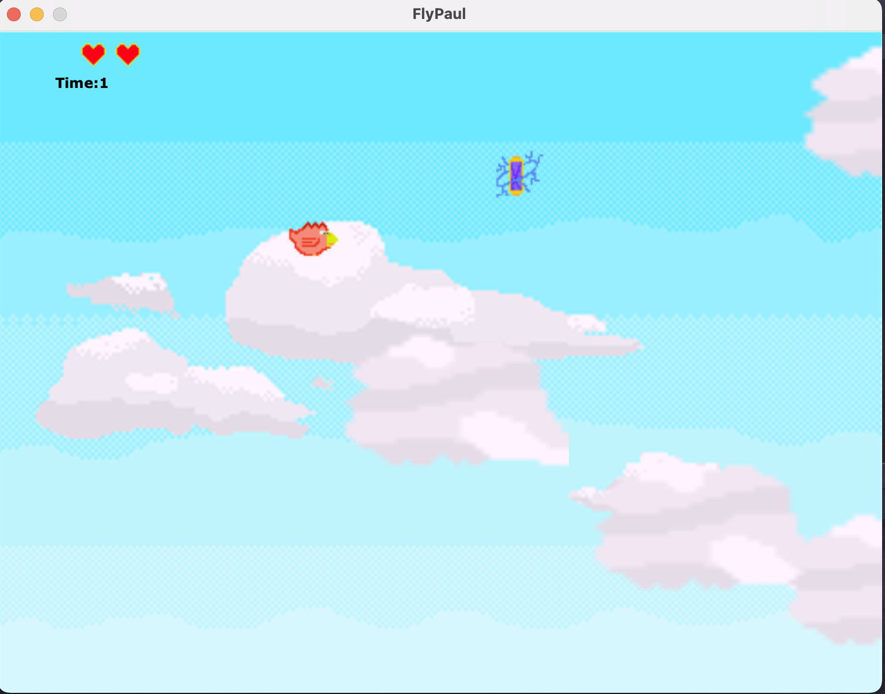
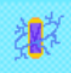
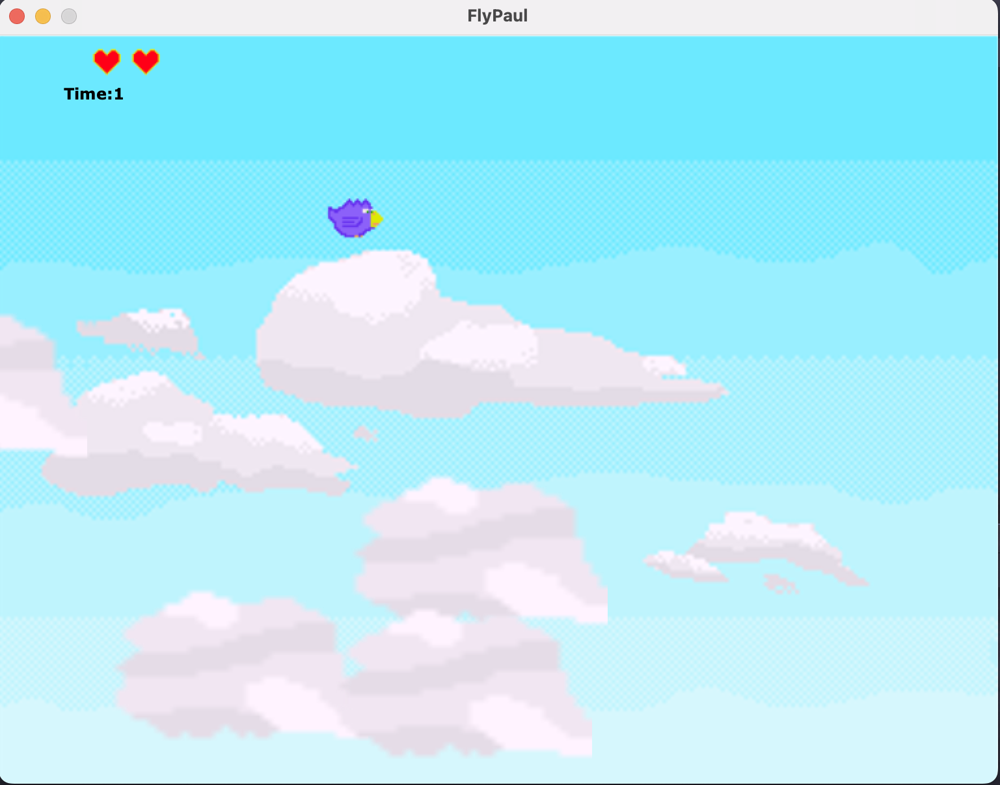

# FlyPaul

Is this repo useful? Please ⭑Star this repository and share the love.

It's a simple 2D Game base on ```Javax.Swing``` implemented in [Scala](https://www.scala-lang.org).

The goal in the game is dodge the ```clouds``` that are getting faster during 5 minutes.

All Sprites has been implemented using [piskelapp](https://www.piskelapp.com/) webpage.

# 

## Icons 

During the time we play the level, we can obtain some power up potions to improve the gameplay of the game temporally.

# 

## How to Play

Clone the repo, and run ```Main``` class

## Keyboard

* In normal ```bird``` state, we only need to press ```space``` to fly, and try to dodge the ```clouds```

```^ Space```


* We can use some ````powerUp```` potions to extend the keyboard, and being able to move ```Up```
and ````Down```` during **30** seconds. Our bird it will turn into ```Super Bird``` mode in purple color.

```^ Key Up v Key Down```

# 
